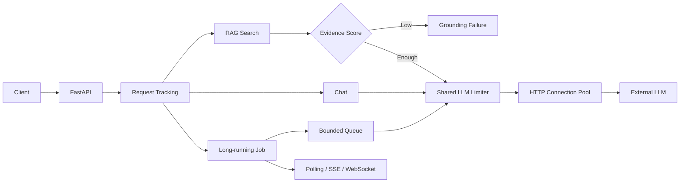
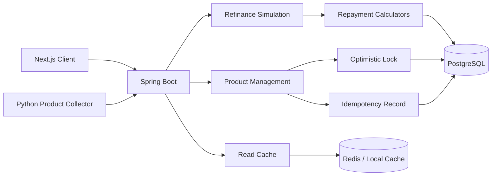
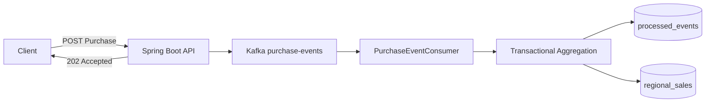
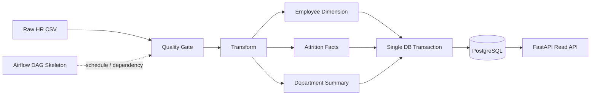
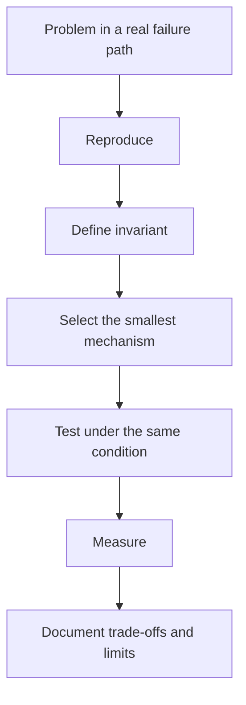

<div align="center">

# HAN YOUNGSEO

### Reliability-driven Backend Engineer

**Backend Systems for AI, Finance, Event Streaming, and Data Pipelines**

동시 요청, 재시도, 외부 API 지연, 중복 전달, 데이터 누수처럼  
**운영에서 실제로 시스템을 깨뜨리는 조건을 재현하고, 결과가 틀어지지 않는 구조를 설계합니다.**

`REPRODUCE FAILURE → DEFINE INVARIANT → DESIGN → MEASURE → VERIFY`

<br/>


</div>

---

## Engineering Focus

기능이 한 번 동작하는 것보다 **동시에 요청이 들어오고, 같은 요청이 재시도되고, 외부 서비스가 느려지고, 일부 단계가 실패해도 결과가 일관되게 유지되는지**를 중요하게 봅니다.

새로운 기술을 먼저 추가하지 않습니다. 문제를 재현하고, 지켜야 할 불변조건을 정하고, 가장 작은 해결책을 적용한 뒤 같은 조건에서 다시 검증합니다.

```text
Concurrency        → 갱신 손실, 동시 호출 폭주를 어떻게 막을 것인가
Consistency        → 중복 요청과 부분 실패에도 결과를 한 번만 반영할 수 있는가
Async Processing   → 느린 외부 I/O와 후속 작업을 요청 경로에서 어떻게 분리할 것인가
Transactions       → 어떤 작업까지 함께 성공하거나 함께 실패해야 하는가
Data Reliability   → 잘못된 데이터와 미래 정보가 결과를 오염시키지 않는가
Observability      → 처리량뿐 아니라 p95, p99, 오류율, 대기시간까지 확인할 수 있는가
```

---

## Impact at a Glance

| Project | 기존 문제 | 개선 | 검증 결과 |
|---|---|---|---|
| [Reliable LLM Chatbot Backend](https://github.com/kangwoul2/llm-chat-platform) | 일반 채팅과 RAG가 서로 다른 경로로 LLM을 호출해 동시 호출 제한이 우회됨 | 모든 생성 경로가 동일한 세마포어를 공유하도록 통합 | 혼합 요청에서 최대 동시 LLM 호출 **6 → 2 이하** |
| [Commerce Event Pipeline](https://github.com/kangwoul2/commerce-event-pipeline) | Kafka 재전달 시 같은 구매 이벤트가 DB 집계에 중복 반영될 수 있음 | 이벤트 ID 유일성 제약조건, 하나의 트랜잭션, 원자적 매출 증가 | 같은 이벤트를 **N회 전달해도 DB 반영은 1회** |
| [Market Prediction Research](https://github.com/kangwoul2/market-prediction-research) | 랜덤 분할과 미래 정보 혼입으로 시계열 성능이 과대평가될 수 있음 | Point-in-Time 정렬, Purged Walk-Forward, Train-only 피처 선택, 설정 잠금 | 시간순 검증 **Macro F1 0.6588 / Balanced Accuracy 0.6861 / ROC AUC 0.7239** |
| [Loan Refinance Service](https://github.com/kangwoul2/loan-refinance-service) | 금융 계산 오차, 동시 수정의 갱신 손실, 재시도 중복 저장 가능성 | BigDecimal, 낙관적 락, 멱등성 키, DB 유일성 제약조건 | 오래된 버전 수정은 **HTTP 409**, 중복 적재는 같은 논리 결과로 수렴 |
| [HR Data Pipeline](https://github.com/kangwoul2/hr-data-pipeline) | 노트북 실행 순서와 수작업에 따라 분석 재현성이 달라짐 | 품질 검사, 명시적 변환, 트랜잭션 적재, 조회 API로 분리 | **1,470행** 데이터에 6개 필수 열 검사, 3개 테이블 모델, 자동 테스트 기반 검증 |

> 측정하지 않은 성능 개선율은 작성하지 않습니다. 수치가 없는 프로젝트는 정합성, 장애 격리, 재현성처럼 코드와 테스트로 확인 가능한 변화만 설명합니다.

---

# Selected Projects

## 01. Reliable LLM Chatbot Backend

**외부 LLM이 느리거나 요청이 몰려도 서버가 통제 가능한 상태를 유지하도록 설계한 FastAPI 백엔드입니다.**

[Repository](https://github.com/kangwoul2/llm-chat-platform)

### Problem → Design → Result

| | 내용 |
|---|---|
| **Problem** | LLM 호출은 네트워크 대기가 길고, 비동기로 요청을 많이 받으면 오히려 외부 API 동시 호출이 폭증할 수 있습니다. |
| **Design** | `async/await`, 공유 세마포어, 제한된 작업 대기열, HTTP 연결 풀, 제한된 재시도, BM25 기반 RAG 근거 확인을 적용했습니다. |
| **Result** | 일반 채팅과 RAG 혼합 부하에서 제한값 2임에도 실제 동시 호출이 6까지 증가하는 버그를 재현했고, 공용 limiter로 통합한 뒤 **2 이하로 유지**되는 것을 자동 테스트로 고정했습니다. |

### Service Flow



### What Improved

- 비동기 처리를 단순 처리량 증가가 아니라 **I/O 대기 중 서버 자원 활용** 문제로 분리했습니다.
- 세마포어와 bounded queue를 이용해 과부하를 무한 대기가 아니라 **통제 가능한 거절과 대기 상태**로 바꿨습니다.
- RAG도 일반 채팅과 같은 동시성 제어 경로를 사용하도록 수정해 우회 경로를 제거했습니다.
- 처리량뿐 아니라 p95, p99, 오류율, 대기시간을 함께 보도록 측정 구조를 설계했습니다.

---

## 02. Loan Refinance Service

**대환대출의 실제 총비용을 정확하게 계산하고, 동시에 상품 정보가 수정되거나 수집 요청이 재시도돼도 데이터가 조용히 틀어지지 않도록 만든 Spring Boot 서비스입니다.**

[Repository](https://github.com/kangwoul2/loan-refinance-service)

### Problem → Design → Result

| | 내용 |
|---|---|
| **Problem** | 단순 금리 비교만으로는 실제 대환 이익을 판단하기 어렵고, 동시 수정에서는 앞선 변경이 사라질 수 있으며, 수집기 재시도는 같은 상품을 중복 저장할 수 있습니다. |
| **Design** | `BigDecimal` 금융 계산, 전략 패턴 기반 상환 계산기, JPA `@Version`, `Idempotency-Key`, DB 유일성 제약조건, 짧은 트랜잭션 경계를 적용했습니다. |
| **Result** | 오래된 버전의 동시 수정은 조용한 덮어쓰기가 아니라 **HTTP 409 Conflict**로 드러나고, 재시도 요청과 상품 중복은 애플리케이션과 DB 두 계층에서 차단하도록 만들었습니다. |

### Service Architecture



### What Improved

- 금액과 금리 계산을 `double`이 아닌 `BigDecimal`로 다뤄 **계산 정확성을 기능이 아니라 품질 조건**으로 만들었습니다.
- 상품 수정 충돌을 낙관적 락으로 감지해 **silent lost update를 명시적인 409 충돌**로 바꿨습니다.
- 외부 데이터 수집은 트랜잭션 밖에서 수행하고 DB 쓰기만 짧게 묶어 **외부 I/O가 DB 트랜잭션을 오래 점유하지 않도록** 했습니다.
- 캐시는 단순 속도 도구가 아니라 단일 서버와 다중 서버에서의 일관성 요구를 기준으로 선택하도록 설계했습니다.

---

## 03. Commerce Event Pipeline

**구매 요청과 후속 집계를 Kafka로 분리하고, 중복 전달과 동시 처리에서도 매출 집계가 정확히 한 번의 결과로 수렴하도록 만든 이벤트 기반 백엔드입니다.**

[Repository](https://github.com/kangwoul2/commerce-event-pipeline)

### Problem → Design → Result

| | 내용 |
|---|---|
| **Problem** | Kafka는 같은 이벤트를 다시 전달할 수 있고, 여러 소비자가 동시에 같은 집계값을 수정하면 중복 반영과 갱신 손실이 발생할 수 있습니다. |
| **Design** | 이벤트 ID 유일성 제약조건, `processed_events`와 실제 집계의 단일 트랜잭션, PostgreSQL 원자적 증가 연산, 지역 기반 partition key를 적용했습니다. |
| **Result** | 같은 이벤트를 **N회 재전달해도 최종 매출 반영은 1회**로 유지하도록 만들었고, 애플리케이션의 read-modify-write 대신 DB 원자 연산으로 갱신 손실 경로를 제거했습니다. |

### Event Flow



### What Improved

- 사용자 요청 경로와 후속 분석 집계를 분리해 **후속 처리 장애가 구매 API 책임으로 전파되는 범위**를 줄였습니다.
- 최소 한 번 전달을 없애려 하기보다 **재전달되어도 결과가 한 번만 반영되는 소비자**를 설계했습니다.
- 중복 기록과 매출 반영을 하나의 트랜잭션으로 묶어 중간 실패가 데이터 누락으로 이어지는 경로를 차단했습니다.
- 분산 락을 먼저 사용하지 않고 DB 유일성 제약조건과 원자 연산으로 문제를 더 작게 해결했습니다.

---

## 04. HR Data Pipeline

**사람이 노트북 셀을 순서대로 실행하던 HR 분석을, 같은 입력에서 같은 결과를 다시 만들 수 있는 데이터 파이프라인으로 구조화했습니다.**

[Repository](https://github.com/kangwoul2/hr-data-pipeline)

### Problem → Design → Result

| | 내용 |
|---|---|
| **Problem** | 셀 실행 순서와 수작업에 따라 결과가 달라질 수 있고, 잘못된 데이터가 분석 단계까지 들어가도 초기에 차단되지 않았습니다. |
| **Design** | Quality Gate → Transform → PostgreSQL Transaction Load → FastAPI 조회 경로로 분리했습니다. |
| **Result** | **1,470행** HR 데이터에 대해 6개 필수 열, 직원 ID 중복, 급여와 이직 값 검사를 앞단에 두고, 결과를 3개 관계형 테이블로 분리해 재현 가능한 적재 구조를 만들었습니다. |

### Data Flow



### What Improved

- 잘못된 입력을 임의로 버리는 대신 **파이프라인을 실패시켜 원본 확인이 필요한 상태를 명확히** 했습니다.
- `to_sql(replace)` 대신 기존 제약조건을 유지하면서 하나의 트랜잭션으로 재적재해 **부분 성공 상태를 남기지 않도록** 했습니다.
- 분석 결과를 CSV나 노트북에 가두지 않고 조회 API로 제공할 수 있는 데이터 모델로 분리했습니다.
- Airflow는 현재 실행 관리용 DAG 뼈대까지만 구현했으며, 실제 ETL 함수 연결 범위는 과장하지 않고 구분했습니다.

---

## 05. Market Prediction Research

**Bitcoin을 더 복잡한 모델로 맞히는 것보다, 미래정보 누수를 제거했을 때 실제로 남는 예측 신호가 무엇인지 다시 검증한 시계열 연구입니다.**

[Repository](https://github.com/kangwoul2/market-prediction-research)

### Problem → Design → Result

| | 내용 |
|---|---|
| **Problem** | 시계열을 랜덤하게 나누거나 전체 데이터로 전처리 기준을 계산하면 미래 정보가 학습 과정에 들어가 성능이 과대평가될 수 있습니다. |
| **Design** | Point-in-Time 정렬, `target_end_date` 기반 purge, Walk-Forward Validation, Train-only Mutual Information, 피처군 ablation, threshold 시간순 검증, 재현성 fingerprint를 적용했습니다. |
| **Result** | 방향 예측은 ROC AUC **0.5130**으로 거의 무작위였지만, 큰 움직임 발생 여부는 최종 시간순 검증에서 **Macro F1 0.6588 / Balanced Accuracy 0.6861 / ROC AUC 0.7239**를 기록했습니다. |

### Research Flow

```mermaid
flowchart LR
    SRC[BTC / Crypto / Macro / On-chain / Sentiment] --> PIT[Point-in-Time Alignment]
    PIT --> FEAT[Feature Engineering]
    FEAT --> TASK[Task Formulation Study]
    TASK --> CV[Purged Walk-Forward]
    CV --> FS[Train-only Feature Selection]
    FS --> SEARCH[Coarse-to-Fine Search]
    SEARCH --> OOF[OOF Probability]
    OOF --> TH[Chronological Threshold Verification]
    TH --> LOCK[Development Config Lock]
    LOCK --> FUTURE[Prospective Evaluation]
```



### What Improved

- 초기의 “상승/하락을 얼마나 잘 맞히는가”에서 **어떤 문제 정의가 검증 가능한 신호를 남기는가**로 질문을 바꿨습니다.
- Always No Move baseline의 Macro F1 **0.4178** 대비 최종 모델은 **0.6588**로, 불균형 클래스에서도 두 상태를 구분하는 성능을 확인했습니다.
- BTC만 보지 않고 ETH, BNB, XRP, SOL, ADA, DOGE, LTC와 SPY, QQQ, Gold, DXY, VIX, TLT, 온체인 지표를 ablation으로 비교했습니다.
- 최종 설정은 최근 730일, 7일 변동성, `k=1.1`, BTC + Crypto, ExtraTrees, 상위 50개 피처로 잠그고 이후 미래 데이터 평가와 분리했습니다.
- 재현성 manifest에 코드, 데이터, 패키지, 설정 hash를 저장해 동일 실험의 출처를 추적할 수 있게 했습니다.

---

## Engineering Principles Across Projects



| 원칙 | 프로젝트에서의 적용 |
|---|---|
| **Correctness before scale** | 금융 계산 정밀도, DB 무결성, 시계열 누수 방지 |
| **Idempotency over wishful exactly-once** | Kafka 소비자, 상품 적재 재시도 |
| **Bounded concurrency** | LLM 세마포어와 bounded queue |
| **Short transaction boundaries** | 외부 I/O와 DB 쓰기 분리 |
| **Database as the final consistency boundary** | 유일성 제약조건, 원자적 갱신, rollback |
| **Measure before claiming improvement** | LLM 동시 호출, 시계열 CV, 데이터 검증 결과 |

---

## Technical Stack

| Area | Technologies |
|---|---|
| Backend | Java 17, Spring Boot, Spring Data JPA, FastAPI |
| Data | PostgreSQL, SQLAlchemy, Flyway, Pandas |
| Concurrency / Messaging | Kafka, asyncio, Semaphore, Bounded Queue |
| Cache / Coordination | Redis, Spring Cache |
| AI / ML | RAG, BM25, scikit-learn, LightGBM, CatBoost, Time-series Validation |
| Testing / Verification | JUnit, pytest, GitHub Actions, Prometheus metrics, p95/p99, Macro F1 |

---

## Experience

### Samsung Software AI Academy
**Java Track | 2026.07 - Present**

Java 알고리즘과 Spring 기반 백엔드 개발 역량을 강화하고 있습니다.

### Programmers Data Analysis Devcourse
**Project Leader | 2025.08 - 2025.12 | 564 hours**

ETL, SQL 데이터 모델링, 머신러닝, 시계열 분석을 학습하고 무역 데이터 기반 공행성 분류와 무역량 예측 프로젝트를 이끌었습니다.

### Infonet AI / Blockchain Graduate Research Lab
**Research Intern | 2024.06 - 2025.03**

온체인 데이터와 소셜 데이터를 결합한 Bitcoin 방향 예측을 연구하고, VADER 감성과 정량 변수 결합 및 모델 재현성을 검토했습니다.

### J2Tomorrow1
**CUOP Industry Intern | 2023.12 - 2024.03**

AWS 기반 웹사이트 제작, 프론트엔드 구현, 데이터 수집, 기술 자료 작성, 서버 점검 업무를 경험했습니다.

### Gi-ant
**Founder / Operator | 2022.09 - 2023.06**

약 40명 규모의 경제 기업분석 동아리를 창설하고 DCF, 산업 분석, IR 자료 분석을 주제로 팀별 연구와 발표 과정을 운영했습니다.

---

## Education

**Gwangju Institute of Science and Technology (GIST)**  
B.S. | 2019.03 - 2025.08

**Daegu Science High School**  
2016.03 - 2019.02

---

<div align="center">

### Build for the failure path, not only the happy path.

측정하지 않은 성능은 성과로 적지 않습니다.  
구현한 범위, 검증한 결과, 아직 남은 한계를 함께 기록합니다.

</div>
